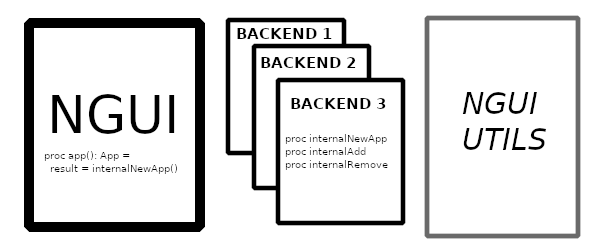

============
Architecture
============

:Author: WhiteDuke

.. contents::

Introduction
============
  
This is a small overview of how NGUI works internally. The core of NGUI are
three modules:

- `ngui.nim <ngui.html>`_:
  Where the Widgets (`NElements`) and procedures are described.
- `ngui_backend_interface.nim <ngui_backend_interface.html>`_:
  This is a list of functions that serve as the
  interface between ngui and some guitoolkit. At the moment only `GTK3` is
  supported. `ngui.nim <ngui.html>`_ will communicate with the backend
  through `internalX` functions (for example: internalNewApp,
  internalGetText, internalAdd ...)
- ngui_backend_util.nim: A set of util functions to make the implementation of
  backends simpler.
  
As an example of an implementation, checkout the module
`src/backends/ngui_begtk3.nim`

GTK3 Backend
============
  
TODO
